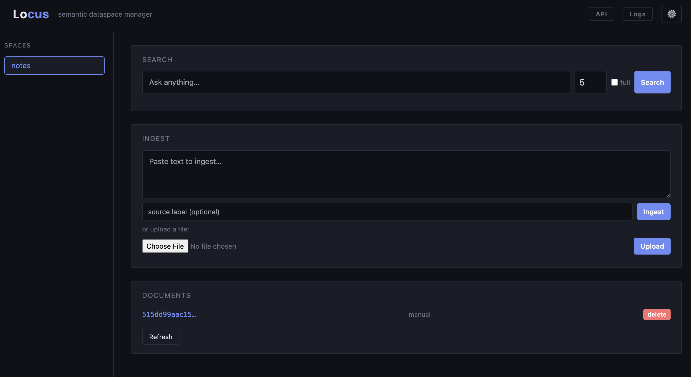

# Locus

[](https://github.com/MiguelAPerez/locus/actions/workflows/ci.yml)
[](https://github.com/MiguelAPerez/locus/actions/workflows/release.yml)

**Semantic dataspace manager.** Create isolated spaces, ingest documents, and search them with natural language — all through a simple REST API or the built-in web UI.

Locus pairs with any [Ollama](https://ollama.com) instance for local embeddings, stores vectors in [ChromaDB](https://www.trychroma.com/), and keeps raw assets on disk. No cloud dependencies.



---

## Features

- **Dataspaces** — isolated namespaces, each with its own vector index and file store
- **Semantic search** — cosine similarity over Ollama embeddings
- **Full document fetch** — retrieve the original ingested text by ID
- **File or text ingest** — POST plain text or upload `.txt`, `.md`, `.csv`, `.json`, `.pdf`, images, and audio files
- **PDF extraction** — text layer extracted via pypdf
- **Image OCR** — text extracted from images via Tesseract
- **Audio transcription** — speech-to-text via Whisper (runs locally)
- **Collections** — group spaces and search across all of them with a single query
- **Optional auth** — per-user login, API keys, and admin controls (disabled by default)
- **Web UI** — dark-themed single-page interface served at `/`
- **Curl-friendly** — every operation is a plain HTTP call, no SDK required
- **Containerized** — single Docker image, connects to your existing Ollama instance

---

## Quick start

### Pull from registry (recommended)

Pre-built images are published to the GitHub Container Registry on every release:

```bash
docker pull ghcr.io/miguelaperez/locus:latest
```

```bash
docker run -d \
  --name locus \
  -p 8000:8000 \
  -e OLLAMA_URL=http://host.docker.internal:11434 \ # Point to your Ollama instance
  -e EMBED_MODEL=nomic-embed-text \ # Default embedding model name
  -v locus_data:/data \
  ghcr.io/miguelaperez/locus:latest
```

### Build locally

```bash
cp .env.example .env
# Edit .env to point OLLAMA_URL at your Ollama instance

docker compose up --build -d
```

Open [http://localhost:8000](http://localhost:8000) for the UI, or jump straight to the API.

### Local (dev)

```bash
python -m venv .venv && source .venv/bin/activate
pip install -r requirements.txt

export OLLAMA_URL=http://localhost:11434
export DATA_DIR=./data

uvicorn app.main:app --reload
```

---

## Configuration

All configuration is via environment variables (or `.env`):

| Variable | Default | Description |
|---|---|---|
| `OLLAMA_URL` | `http://host.docker.internal:11434` | URL of your Ollama instance |
| `EMBED_MODEL` | `nomic-embed-text` | Model name for embeddings |
| `DATA_DIR` | `/data` | Root directory for spaces and assets |
| `MAX_UPLOAD_MB` | `100` | Maximum file upload size in megabytes |
| `LOCUS_PORT` | `8000` | Host port (Docker only) |

Auth is disabled by default — all requests run as a built-in `guest` user. See [docs/auth.md](docs/auth.md) to enable per-user login, API keys, and admin controls.

Make sure the embedding model is already pulled in your Ollama instance:

```bash
ollama pull nomic-embed-text
```

---

## API reference

### Spaces

```
POST   /spaces              Create a new dataspace
GET    /spaces              List all dataspaces
DELETE /spaces/{space}      Delete a space and all its data
```

### Collections

```
POST   /collections                           Create a new collection
GET    /collections                           List all collections
GET    /collections/{name}                    Get collection details (member spaces)
DELETE /collections/{name}                    Delete a collection
POST   /collections/{name}/spaces/{space}     Add a space to a collection
DELETE /collections/{name}/spaces/{space}     Remove a space from a collection
```

```
GET /collections/{name}/search?q=...&k=5&full=false
```

| Param | Default | Description |
|---|---|---|
| `q` | required | Search query (regex pattern when `mode=regex`) |
| `k` | `5` | Number of results (1–500) |
| `mode` | `semantic` | Search mode: `semantic` or `regex` |
| `full` | `false` | Include full document text alongside each chunk |

### Documents

```
POST   /spaces/{space}/documents              Ingest text or a file
GET    /spaces/{space}/documents              List documents in a space
GET    /spaces/{space}/documents/{id}         Fetch full document text
DELETE /spaces/{space}/documents/{id}         Delete a document
```

### Search

```
GET /spaces/{space}/search?q=...&k=5&full=false
```

| Param | Default | Description |
|---|---|---|
| `q` | required | Search query (regex pattern when `mode=regex`) |
| `k` | `5` | Number of results (1–500) |
| `mode` | `semantic` | Search mode: `semantic` or `regex` |
| `full` | `false` | Include full document text alongside each chunk |

### Other

```
GET /health     Service health check
GET /           Web UI
GET /docs       Auto-generated OpenAPI docs (FastAPI)
```

---

## Example curl session

```bash
BASE=http://localhost:8000

# Create a space
curl -s -X POST $BASE/spaces \
  -H 'Content-Type: application/json' \
  -d '{"name": "research"}' | jq

# Ingest text
curl -s -X POST $BASE/spaces/research/documents \
  -F "text=The mitochondria is the powerhouse of the cell." \
  -F "source=biology-101" | jq

# Upload a file
curl -s -X POST $BASE/spaces/research/documents \
  -F "file=@notes.txt" | jq

# Semantic search
curl -s "$BASE/spaces/research/search?q=cellular+energy&k=3" | jq

# Fetch full document
curl -s "$BASE/spaces/research/documents/{doc_id}" | jq

# List spaces
curl -s $BASE/spaces | jq

# Delete a space
curl -s -X DELETE $BASE/spaces/research | jq

# Create a collection and add spaces to it
curl -s -X POST $BASE/collections \
  -H 'Content-Type: application/json' \
  -d '{"name": "science"}' | jq

curl -s -X POST $BASE/collections/science/spaces/research | jq

# Search across all spaces in the collection
curl -s "$BASE/collections/science/search?q=cellular+energy&k=3" | jq
```

---

## Development

### Running tests

```bash
python -m venv .venv && source .venv/bin/activate
pip install -r requirements.txt -r requirements-dev.txt
pytest tests/ -v --cov=app
```

### Releases

Releases are driven by [Commitizen](https://commitizen-tools.github.io/commitizen/) using conventional commits.

```bash
# bump version, update CHANGELOG, create tag
cz bump

# push the tag to trigger the release workflow
git push origin main --tags
```

The release workflow builds and pushes the Docker image to `ghcr.io/miguelaperez/locus:<tag>` and `ghcr.io/miguelaperez/locus:latest`.

---

## Project structure

```
.
├── app/
│   ├── main.py          # FastAPI app and all routes
│   ├── embeddings.py    # Ollama embedding client
│   ├── extractors.py    # PDF, image OCR, and audio transcription
│   ├── store.py         # ChromaDB vector store wrapper
│   ├── spaces.py        # File I/O, chunking, space management
│   └── static/
│       └── index.html   # Web UI
├── tests/               # pytest test suite
├── .github/workflows/
│   ├── ci.yml           # Run tests on push / PR
│   └── release.yml      # Build & push Docker image on tag
├── docs/
│   ├── architecture.md  # System design and data flow
│   └── auth.md          # Auth setup and API reference
├── Dockerfile
├── docker-compose.yml
├── pyproject.toml       # Commitizen config & version
├── requirements.txt
├── requirements-dev.txt
└── .env.example
```

---

## License

MIT
